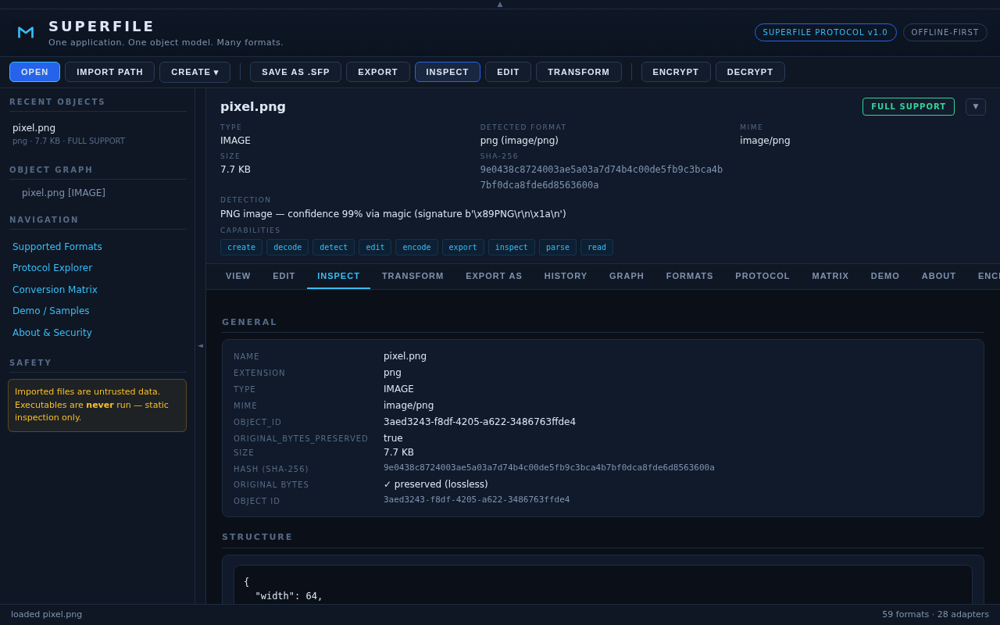
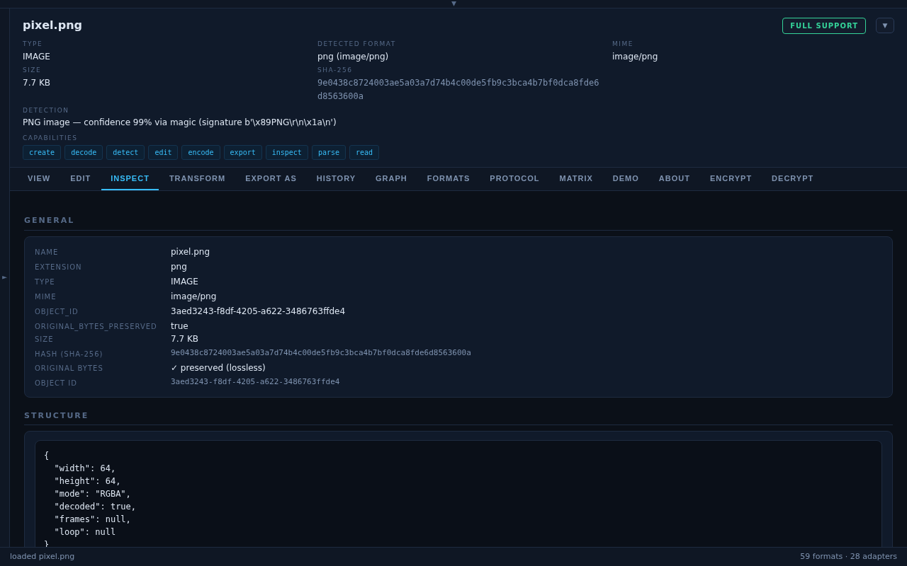
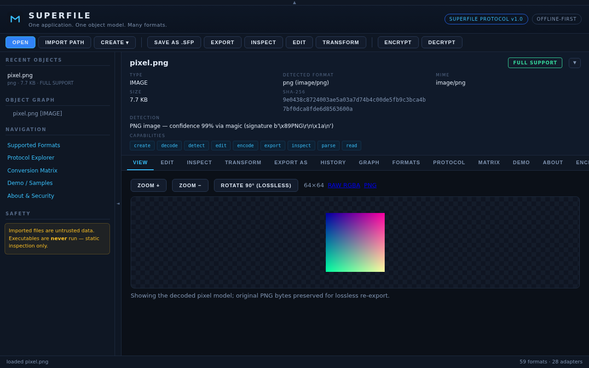
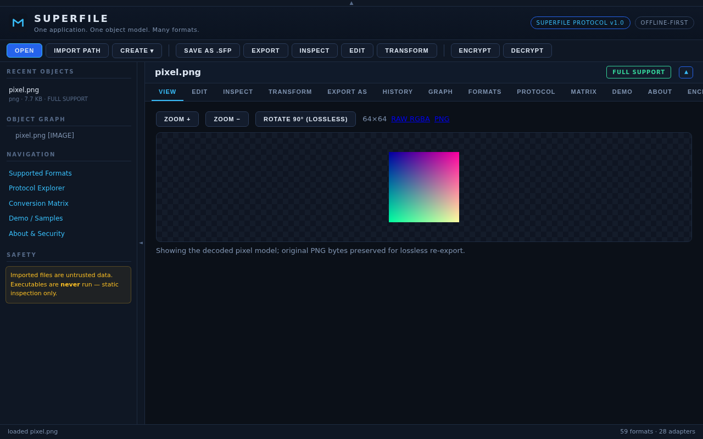

# UI layout toggles — collapsible top bar, sidebar and file details

Three handles give the content area more room. **UI-only and additive**: no existing id, class or handler was
changed, and the only structural edit is documented below (the file-detail elements moved into one sliding
container). Both changes are proved additive byte for byte by `tests/ui_layout_check.py --orig-ui`.

| handle | where | collapses | what stays |
|---|---|---|---|
| `#sf-top-toggle` (▲ / ▼) | first child of `#app`, above `#titlebar` | `#titlebar` **and** `#toolbar`, as one unit | a 12 px strip |
| `#sf-side-toggle` (◄ / ►) | in `#main`, on the right edge of `#sidebar` | `#sidebar` (250 px → 0) | a 14 px rail with the re-open arrow |
| `#sf-oh-toggle` (▼ / ▲) | on the file-details row (`.oh-row`), right of the badge | `#sf-oh-details` = `.oh-grid` + `.oh-caps` + warnings | the 24 px row: filename + badge + arrow |






## Behaviour

* **Animation, 0.2 s ease.** Top: the two bars' height/padding/border/opacity are measured live (so a wrapped
  toolbar animates correctly) and animated in lock-step; sidebar: width/padding/border transition, its contents
  slide instead of re-wrapping. `prefers-reduced-motion` → instant. A second click mid-animation reverses from
  where it is.
* **Nothing is removed or re-rendered.** Collapsed panels are hidden (`display:none` / width 0 +
  `visibility:hidden`), so recent list, object tree, inspector data, scroll position and the hidden
  `#file-input` all survive, and hidden controls leave the tab order. Buttons carry `aria-expanded`,
  `aria-controls` and labels; both work from the keyboard.
* **State** = classes on `<html>` (`sf-top-collapsed`, `sf-side-collapsed`), persisted in `localStorage`
  (`sf_top_collapsed`, `sf_sidebar_collapsed` = `"1"`/`"0"`), every access in try/catch. A 6-line snippet in
  `<head>` restores it before the first paint (no flash). `app.js` had no storage convention before; this is the
  first `localStorage` use.
* **Why a flex-sibling rail** and not an absolutely positioned tab: `#sidebar` has `overflow-y:auto`, which would
  clip anything hanging over its border, and a sibling can never overlap sidebar or content.

Files touched (0 lines removed): `ui/index.html` +25, `ui/app.css` +47, `ui/app.js` +105.

## Known limits (observed, not assumed)

* State is stored per **origin** `http://127.0.0.1:<port>`. The launcher prefers port 8765; when it is busy it
  falls back to 8766–8790 — a different origin with its own, empty storage (observed in a real browser).
* Canvases sized in JS at draw time (the WAV waveform) are not redrawn when their pane widens; they are
  CSS-stretched (974 px bitmap shown at 1226 px), exactly as when the browser window is resized.
* Pre-existing, untouched: the welcome screen's "CREATE AN OBJECT" never shows its menu (the app's outside-click
  handler closes it in the same click); the toolbar's CREATE works. Identical before and after this change.
* Verified in headless **Chromium 154** only (no Firefox / Safari / Edge run).

## Measured (1280×800, both with a PNG loaded)

| state | `#content` | |
|---|---|---|
| expanded | 1016 × 660 | strip 12 + title bar 60.5 + toolbar 40 above; sidebar 250 + rail 14 on the left |
| top collapsed | 1016 × 760.5 | +100.5 = exactly title bar + toolbar |
| sidebar collapsed | 1266 × 660 | +250 = exactly the sidebar (flex:1, no JS sizing) |
| both collapsed | 1266 × 760 | 98.9 % of the width, 95.1 % of the height (the rest: strip, rail, status bar) |

## Re-verify (real browser, real server)

```bash
pip install playwright                      # + a Chromium/Chrome/Edge binary (--browser PATH)
# 1. record the PREVIOUS ui's behaviour from a copy of the old tree:
python tests/ui_layout_check.py --spawn-source <old_tree> --mode functional --dump base.json
# 2. everything, on the current tree (or --spawn-exe release/Superfile.exe):
python tests/ui_layout_check.py --spawn-source . --baseline base.json --orig-ui <old_tree>/ui
```

96 checks when this document was written (before the ENCRYPT/DECRYPT tabs existed): A/B click-through of every
existing control (284 observations identical to the previous UI, also after
toggling), served UI byte-identical to the source, geometry, animation frames, DOM identity (same node objects,
zero mutations), reload / new tab / browser+server restart persistence, keyboard, rapid clicks, scroll positions,
narrow window, reduced motion, blocked storage, the file-details slide (frames, tab-strip anchor, clamp at the
bottom of a pane, composition with the `"hidden"` class and with the other two toggles) and zero console errors.
The suite was also run against **seven** deliberately broken variants — display:none instead of a slide, dropped
persistence (twice), a title bar left behind, a re-rendered sidebar, an instant top bar — and failed on each.
Static guards for the same hooks live in `tests/test_all.py` (`TestUiLayoutToggles`, `TestObjectHeaderSlide`).

> Task C (ENCRYPT/DECRYPT) later appended two toolbar buttons and two content tabs, so the same suite now runs
> **135 checks** against the packaged exe and **127** against the source tree (the extras drive the new tabs and
> the password/device flows); the documented additions are filtered out of the A/B comparison by
> `expected_additions()` while every pre-existing observation must still match — see
> `release/UI_LAYOUT_CHECK.txt`.
